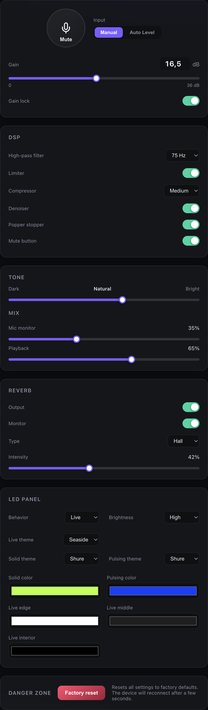

# Shure MV7+ Web Console

An independent, community-developed Linux application for controlling a Shure
MV7+ microphone without requiring the vendor's desktop software. It talks
directly to the microphone's vendor HID interface and serves an embedded
browser interface over HTTP and WebSocket.

> [!IMPORTANT]
> This is an unofficial independent project. It is not affiliated with,
> authorized, sponsored, endorsed, or supported by Shure Incorporated in any
> way. Shure and MV7+ are trademarks of Shure Incorporated and are used here
> only to identify compatible hardware.

The server listens on `127.0.0.1:8090` by default, keeping the control
interface available only on the local machine. It can also be configured for
remote control, for example to adjust a microphone connected to a Linux
streamer PC from another computer.



## Supported controls

- Gain, gain lock, mute, Manual mode, and Auto Level mode
- High-pass filter, limiter, compressor, denoiser, and Popper Stopper
- Tone and monitor/playback mix
- Reverb output, monitoring, type, and intensity
- LED behavior, brightness, themes, and custom colors
- Physical mute-button enable/disable
- Factory reset

## Hardware and protocol

This application targets the Shure MV7+ with USB vendor/product ID
`14ed:1019`. It does not use the older MV7 ASCII protocol. The MV7+ uses a
binary ADT/DMP protocol over 64-byte HID reports.

The protocol implementation is based on the GPL-3.0-licensed packet captures,
documentation, and implementation in
[Humblemonk/shurectl](https://github.com/Humblemonk/shurectl). This project is
distributed under the GNU General Public License, version 3 only.

## License

Copyright (C) 2026 Annika Wickert. Licensed under GPL-3.0-only. See
[LICENSE](LICENSE).

## Installation

### Fedora RPM

Build and install the RPM on Fedora:

```bash
sudo dnf install golang rpm-build desktop-file-utils
./packaging/fedora/build-rpm.sh
sudo dnf install ./dist/RPMS/shure-mv7-*.rpm
```

The package installs the `mv7web` binary, the **Shure MV7+ Console** desktop
launcher, and a udev rule granting the active desktop user access to the MV7+
HID interface. Unplug and reconnect the microphone after installation, then
launch the console from the application menu.

Remove the package with:

```bash
sudo dnf remove shure-mv7
```

### Ubuntu DEB

Build and install the package on Ubuntu or Debian:

```bash
sudo apt install golang-go dpkg-dev
./packaging/ubuntu/build-deb.sh
sudo apt install ./dist/DEBS/shure-mv7_*.deb
```

The package installs the `mv7web` binary, application launcher, man page, and
Shure MV7+ udev rule. Reconnect the microphone after installation, then launch
**Shure MV7+ Console** from the application menu.

Remove the package with:

```bash
sudo apt remove shure-mv7
```

### Manual Fedora installation

#### 1. Install tools

```bash
sudo dnf install git golang
```

The module currently targets Go 1.26.6. Confirm the installed toolchain with:

```bash
go version
```

#### 2. Clone and build

```bash
git clone https://github.com/awlx/mv7-linux-support.git
cd mv7-linux-support
mkdir -p bin
go build -trimpath -o bin/mv7web ./cmd/mv7web
```

#### 3. Permit HID access

The application needs read/write access to the MV7+ vendor `hidraw` device.
A dedicated group is reliable for both local and SSH sessions on Fedora.

Create the group and add your user:

```bash
sudo groupadd --system shure
sudo usermod -aG shure "$USER"
```

If the group already exists, the first command can be skipped. Install the
udev rule:

```bash
sudo tee /etc/udev/rules.d/62-shure-mv7plus.rules >/dev/null <<'EOF'
SUBSYSTEM=="hidraw", ATTRS{idVendor}=="14ed", ATTRS{idProduct}=="1019", GROUP="shure", MODE="0660"
EOF

sudo udevadm control --reload-rules
sudo udevadm trigger --subsystem-match=hidraw
```

Unplug and reconnect the microphone, then log out and back in so the new group
membership applies. For an SSH session, disconnect and reconnect.

Verify detection and permissions:

```bash
lsusb | grep -i '14ed:1019'
grep -H 'HID_ID=.*000014ED:00001019' /sys/class/hidraw/hidraw*/device/uevent
ls -l /dev/hidraw*
```

The matching device should be writable by the `shure` group.

## Running

Start the server:

```bash
./bin/mv7web
```

It should report:

```text
MV7+ web console listening on http://127.0.0.1:8090
```

Browse to <http://127.0.0.1:8090> on the local machine.

### Desktop launcher

Install the binary and desktop entry after building:

```bash
sudo install -Dm755 bin/mv7web /usr/local/bin/mv7web
install -Dm644 packaging/fedora/shure-mv7.desktop \
  "$HOME/.local/share/applications/shure-mv7.desktop"
update-desktop-database "$HOME/.local/share/applications"
```

The **Shure MV7+ Console** entry will appear in the desktop application menu.
Launching it starts the server and opens the console in the default browser.
Launching it again restarts the current user's server and reopens the console,
so package upgrades cannot leave an older binary running in the background.

The `update-desktop-database` command is optional. If it is unavailable,
install it with `sudo dnf install desktop-file-utils` or log out and back in.

To use a different local port:

```bash
./bin/mv7web -addr 127.0.0.1:9090
```

### Remote use

For remote control of a microphone connected to a streamer PC, the safest
option is to leave `mv7web` on its default loopback address and create an SSH
tunnel from the computer used for control:

```bash
ssh -L 8090:127.0.0.1:8090 user@streamer-pc
```

Then open <http://127.0.0.1:8090> on the controlling computer.

It can also listen directly on the streamer PC's network interfaces:

```bash
./bin/mv7web -addr 0.0.0.0:8090
```

In that configuration, open `http://streamer-pc:8090` from another computer
on the same trusted private network. Restrict access with the host firewall.

`mv7web` does not provide authentication or TLS. Never expose its listening
port directly to the internet. For access beyond a trusted private network,
keep it on loopback and use an SSH tunnel, VPN, or authenticated HTTPS reverse
proxy.

## Development

Run the test suite and static checks:

```bash
go test ./...
go vet ./...
```

Build a static Linux AMD64 binary from another platform:

```bash
mkdir -p bin
CGO_ENABLED=0 GOOS=linux GOARCH=amd64 \
  go build -trimpath -o bin/mv7web-linux-amd64 ./cmd/mv7web
```

The web assets live under `internal/webui/web` and are embedded into the final
binary, so deployment only requires the executable.

Binary RPMs are written to `dist/RPMS/` and source RPMs to `dist/SRPMS/` by
`packaging/fedora/build-rpm.sh`.

To build in a Fedora container instead of installing RPM tools locally:

```bash
docker build -f packaging/fedora/Containerfile -t shure-mv7-rpm .
docker run --rm -v "$PWD:/src" shure-mv7-rpm
```

On an Apple Silicon host, build the Fedora `x86_64` RPM without emulation:

```bash
docker run --rm -e RPM_TARGET=x86_64 -v "$PWD:/src" shure-mv7-rpm
```

### Ubuntu package builds

DEB packages are written to `dist/DEBS/`. To build without installing Debian
packaging tools locally:

```bash
docker build -f packaging/ubuntu/Containerfile -t shure-mv7-deb .
docker run --rm -v "$PWD:/src" shure-mv7-deb
```

On an Apple Silicon host, build an Ubuntu `amd64` package without emulation:

```bash
docker run --rm -e DEB_TARGET_ARCH=amd64 -v "$PWD:/src" shure-mv7-deb
```

### Gain handoff diagnostic

`handoffdiag` is a read-only diagnostic for observing gain while moving the
microphone between hosts. It waits for the MV7+, repeatedly reads its state,
and prints gain, Auto Level mode, and reconnect generation. It never sends a
SET command.

Build and run it on Linux:

```bash
go build -o mv7-handoffdiag ./cmd/handoffdiag
./mv7-handoffdiag
```

Start it before connecting the microphone to capture the first value exposed
by the device after a phone-to-PC handoff. Stop it with `Ctrl+C`.

## Troubleshooting

### MV7+ not found

- Confirm `lsusb` shows `14ed:1019`.
- Confirm the matching `/dev/hidrawN` exists.
- Check that your current session includes the `shure` group with `id`.
- Reconnect the microphone after changing udev rules.
- Make sure another application is not exclusively controlling the device.

### Controls revert in the browser

The UI refreshes from hardware state after each command. If a control reverts,
check the server output for HID read/write errors and verify write permission on
the matching `hidraw` node.

### Browser cannot connect

Confirm the server is running and listening on `127.0.0.1:8090`. Also check
that another process is not already using port 8090.